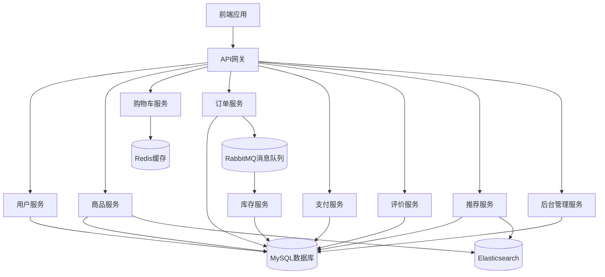
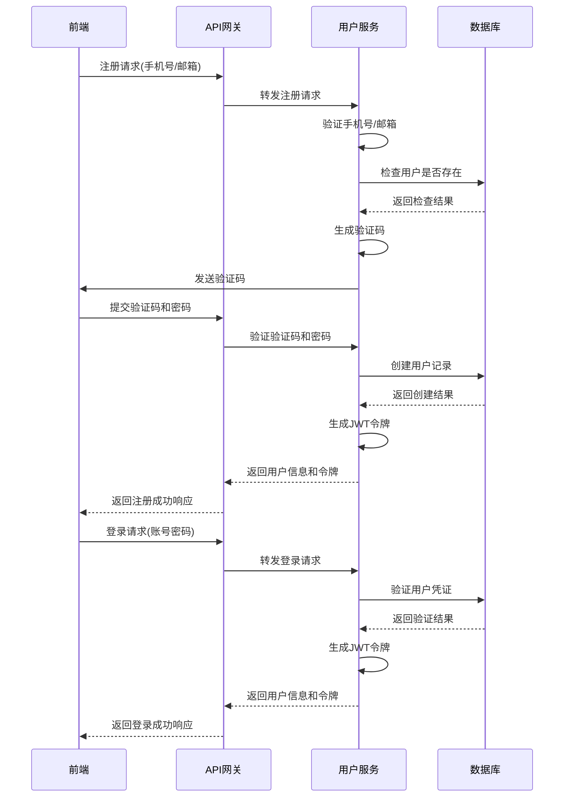
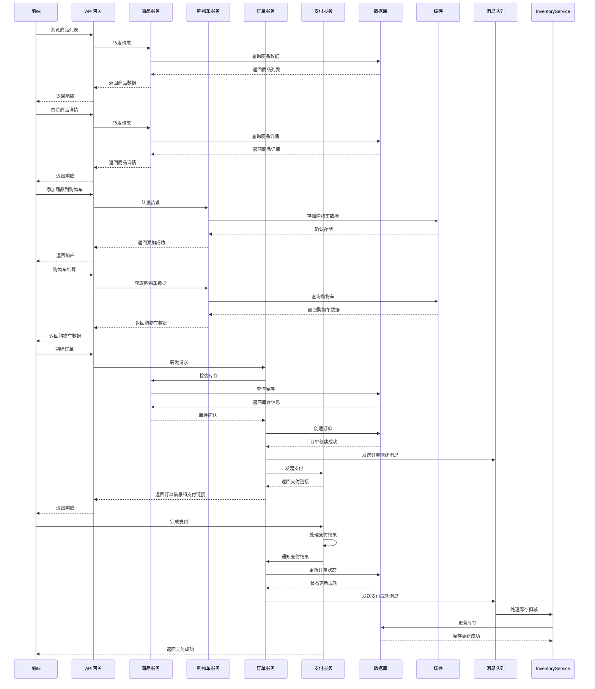

# 电商平台架构文档

## 1. 系统概述

本架构文档描述了基于Spring Boot 4.0.5和WebFlux技术栈的电商平台系统架构。该平台采用微服务架构设计，支持响应式编程，提供完整的电商功能，包括用户管理、商品管理、购物车、订单管理、支付、评价和推荐系统等核心模块。

## 2. 技术选型

### 2.1 核心技术栈

| 分类 | 技术 | 版本 | 选型理由 |
|------|------|------|----------|
| 后端框架 | Spring Boot | 4.0.5 | 提供自动配置和依赖管理，简化开发 |
| 响应式编程 | Spring WebFlux | 4.0.5 | 非阻塞异步编程，提升系统性能和并发处理能力 |
| 数据库 | MySQL | 8.0+ | 成熟的关系型数据库，适合存储结构化数据 |
| 缓存 | Redis | 7.0+ | 用于缓存热点数据，提升响应速度 |
| 搜索引擎 | Elasticsearch | 8.0+ | 用于商品搜索和推荐，提供高效的全文检索能力 |
| 消息队列 | RabbitMQ | 3.10+ | 用于异步处理订单和库存，解耦系统组件 |
| 认证授权 | Spring Security | 6.0+ | 提供JWT认证和基于角色的权限控制 |
| AI集成 | Spring AI | 2.0.0-M4 | 用于智能推荐和客服支持，提升用户体验 |
| 容器化 | Docker | 20.10+ | 应用容器化部署，简化环境管理 |
| 编排 | Kubernetes | 1.24+ | 容器编排和服务发现，提供高可用性 |

### 2.2 第三方服务

| 服务 | 用途 | 说明 |
|------|------|------|
| 短信服务 | 用户注册、验证码 | 用于发送验证码和通知 |
| 支付服务 | 在线支付 | 支持微信支付、支付宝等 |
| 物流服务 | 物流查询 | 提供物流信息查询和跟踪 |
| CDN服务 | 静态资源加速 | 加速图片和静态资源的加载 |

## 3. 架构设计

### 3.1 整体架构

- **微服务架构**：将系统拆分为多个独立的微服务，每个服务负责特定的业务功能
- **响应式设计**：使用WebFlux实现非阻塞异步处理，提升系统性能
- **分层架构**：
  - 表现层（Controller）：处理HTTP请求和响应
  - 业务层（Service）：实现核心业务逻辑
  - 数据访问层（Repository）：与数据库交互
  - 基础设施层：提供通用功能和工具

### 3.2 系统组件图

### 3.3 模块划分

| 模块 | 职责 | 核心功能 |
|------|------|----------|
| 用户服务 | 用户管理 | 注册、登录、个人信息管理、地址管理 |
| 商品服务 | 商品管理 | 商品列表、商品详情、商品搜索、分类管理 |
| 购物车服务 | 购物车管理 | 添加商品、修改数量、删除商品、结算 |
| 订单服务 | 订单管理 | 创建订单、订单状态管理、订单查询 |
| 支付服务 | 支付处理 | 发起支付、支付回调、支付记录 |
| 评价服务 | 评价管理 | 提交评价、查看评价、评价审核 |
| 推荐服务 | 智能推荐 | 个性化推荐、热门商品推荐、相关商品推荐 |
| 后台管理服务 | 后台管理 | 商品管理、订单管理、用户管理、数据统计 |
| 库存服务 | 库存管理 | 库存更新、库存查询 |

## 4. 数据流设计

### 4.1 核心业务流程

#### 4.1.1 用户注册登录流程

#### 4.1.2 商品购买流程

### 4.2 数据流向

1. **用户数据**：用户注册、登录、个人信息修改等操作的数据流向用户服务，存储在MySQL数据库中。
2. **商品数据**：商品的添加、修改、查询等操作的数据流向商品服务，存储在MySQL数据库中，同时同步到Elasticsearch用于搜索。
3. **购物车数据**：购物车的添加、修改、删除等操作的数据流向购物车服务，存储在Redis缓存中。
4. **订单数据**：订单的创建、状态更新等操作的数据流向订单服务，存储在MySQL数据库中，同时通过RabbitMQ消息队列异步处理库存和物流。
5. **支付数据**：支付的发起、回调等操作的数据流向支付服务，存储在MySQL数据库中。
6. **评价数据**：评价的提交、查看等操作的数据流向评价服务，存储在MySQL数据库中。
7. **推荐数据**：推荐的生成、更新等操作的数据流向推荐服务，存储在MySQL数据库和Elasticsearch中。

## 5. 关键技术点

### 5.1 响应式编程

- **WebFlux**：使用Spring WebFlux实现非阻塞异步处理，提升系统性能和并发处理能力。
- **Reactor**：使用Reactor响应式库，提供丰富的操作符和工具，简化响应式编程。
- **背压处理**：通过Reactor的背压机制，控制数据流的速率，防止系统过载。

### 5.2 微服务通信

- **RESTful API**：使用RESTful API进行服务间通信，简单、标准化。
- **Feign**：使用Feign客户端简化服务间调用，减少样板代码。
- **Circuit Breaker**：使用Hystrix或Resilience4j实现断路器模式，提高系统的容错能力。

### 5.3 缓存策略

- **Redis缓存**：使用Redis缓存热点数据，如商品信息、用户会话等。
- **缓存失效策略**：采用TTL（Time To Live）和LRU（Least Recently Used）策略管理缓存。
- **缓存一致性**：通过消息队列或事件总线保证缓存与数据库的一致性。

### 5.4 搜索实现

- **Elasticsearch**：使用Elasticsearch实现商品搜索和推荐。
- **索引管理**：定期更新商品索引，确保搜索结果的准确性。
- **搜索优化**：使用分词器、过滤器和聚合等功能优化搜索性能和结果质量。

### 5.5 消息队列

- **RabbitMQ**：使用RabbitMQ实现异步消息处理，解耦系统组件。
- **消息可靠性**：通过持久化、确认机制和重试策略保证消息的可靠性。
- **消息幂等性**：实现消息的幂等处理，防止重复处理。

### 5.6 安全设计

- **JWT认证**：使用JWT（JSON Web Token）实现无状态认证，减少服务器存储压力。
- **权限控制**：基于角色的权限控制（RBAC），确保用户只能访问授权的资源。
- **数据加密**：对敏感数据进行加密存储，如用户密码、支付信息等。
- **防止攻击**：实现防SQL注入、XSS和CSRF攻击的措施。

### 5.7 AI集成

- **Spring AI**：使用Spring AI集成AI能力，提供智能推荐和客服支持。
- **个性化推荐**：基于用户行为和偏好，使用AI算法生成个性化推荐。
- **智能客服**：使用AI聊天机器人提供24/7客服支持。

## 6. 部署架构

### 6.1 环境配置

| 环境 | 配置 | 说明 |
|------|------|------|
| 开发环境 | 本地开发环境 | 开发人员进行开发和单元测试 |
| 测试环境 | 独立测试服务器 | 功能测试和集成测试 |
| 预生产环境 | 模拟生产环境 | 性能测试和预发布测试 |
| 生产环境 | 正式生产环境 | 正式上线运行 |

### 6.2 容器化部署

- **Docker**：使用Docker容器化应用，确保环境一致性。
- **Docker Compose**：使用Docker Compose管理多容器应用，简化本地开发和测试。
- **Kubernetes**：使用Kubernetes编排容器，提供高可用性、自动扩缩容和服务发现。

### 6.3 服务部署

- **API网关**：部署在前端，统一管理API请求，提供路由、负载均衡和认证。
- **微服务**：部署在Kubernetes集群中，通过服务发现和负载均衡提供服务。
- **数据库**：部署主从架构的MySQL，实现读写分离，提高性能和可用性。
- **缓存**：部署Redis集群，提供高可用性和数据持久化。
- **消息队列**：部署RabbitMQ集群，保证消息的可靠性和高可用性。
- **搜索引擎**：部署Elasticsearch集群，提供分布式搜索和分析能力。

### 6.4 监控和日志

- **系统监控**：使用Prometheus和Grafana监控系统指标，如CPU、内存、网络等。
- **应用监控**：使用Spring Boot Actuator监控应用状态，如健康检查、指标收集等。
- **日志管理**：使用ELK Stack（Elasticsearch、Logstash、Kibana）收集和分析日志。
- **告警系统**：设置阈值告警，及时发现和处理问题。

## 7. 扩展性设计

### 7.1 水平扩展

- **服务水平扩展**：通过增加服务实例数量，提高系统的处理能力。
- **数据库水平扩展**：通过分库分表，提高数据库的存储和处理能力。
- **缓存水平扩展**：通过Redis集群，提高缓存的容量和性能。

### 7.2 垂直扩展

- **服务垂直扩展**：通过升级服务器硬件，提高单实例的处理能力。
- **数据库垂直扩展**：通过升级数据库服务器硬件，提高数据库性能。

### 7.3 服务拆分

- **按业务域拆分**：根据业务域将服务拆分为更小的微服务，如用户服务、商品服务等。
- **按功能拆分**：将复杂的服务拆分为更简单的服务，如订单服务拆分为订单创建服务、订单查询服务等。

### 7.4 API网关

- **流量控制**：通过API网关控制流量，防止系统过载。
- **负载均衡**：通过API网关实现服务的负载均衡，提高系统的可用性和性能。
- **服务发现**：通过API网关实现服务的自动发现，简化服务间通信。

## 8. 安全性设计

### 8.1 认证和授权

- **JWT认证**：使用JWT实现无状态认证，减少服务器存储压力。
- **OAuth2**：支持第三方登录，如微信、支付宝等。
- **基于角色的权限控制**：实现细粒度的权限控制，确保用户只能访问授权的资源。

### 8.2 数据安全

- **数据加密**：对敏感数据进行加密存储，如用户密码、支付信息等。
- **传输加密**：使用HTTPS协议加密数据传输，防止数据被窃取。
- **数据备份**：定期备份数据，防止数据丢失。

### 8.3 防止攻击

- **SQL注入防护**：使用参数化查询，防止SQL注入攻击。
- **XSS防护**：过滤用户输入，防止跨站脚本攻击。
- **CSRF防护**：使用CSRF令牌，防止跨站请求伪造攻击。
- **DDoS防护**：使用CDN和防火墙，防止分布式拒绝服务攻击。

### 8.4 安全审计

- **日志记录**：记录系统操作日志，便于安全审计和问题排查。
- **定期安全扫描**：使用安全工具定期扫描系统，发现和修复安全漏洞。
- **安全更新**：及时更新依赖和系统补丁，防止安全漏洞。

## 9. 性能优化

### 9.1 数据库优化

- **索引优化**：为频繁查询的字段创建索引，提高查询性能。
- **SQL优化**：优化SQL语句，减少查询时间。
- **读写分离**：实现数据库读写分离，提高系统性能。
- **分库分表**：对大表进行分库分表，提高数据库的存储和处理能力。

### 9.2 缓存优化

- **缓存策略**：合理设置缓存策略，如缓存预热、缓存失效等。
- **缓存一致性**：保证缓存与数据库的一致性，避免数据错误。
- **多级缓存**：使用本地缓存和分布式缓存相结合的方式，提高缓存性能。

### 9.3 代码优化

- **响应式编程**：使用WebFlux和Reactor实现非阻塞异步处理，提高系统性能。
- **减少IO操作**：减少不必要的IO操作，如数据库查询、网络请求等。
- **批量处理**：对批量操作进行优化，减少网络往返次数。

### 9.4 服务器优化

- **JVM优化**：调整JVM参数，如堆大小、垃圾收集器等，提高Java应用的性能。
- **操作系统优化**：调整操作系统参数，如文件描述符、网络参数等，提高系统性能。
- **负载均衡**：使用负载均衡器，将请求分发到多个服务器，提高系统的处理能力。

## 10. 故障处理

### 10.1 故障检测

- **健康检查**：定期检查系统组件的健康状态，及时发现故障。
- **监控告警**：设置监控告警，当系统出现异常时及时通知。

### 10.2 故障隔离

- **断路器模式**：使用断路器模式，当服务出现故障时，快速失败并降级，防止故障扩散。
- **服务隔离**：使用容器和命名空间，隔离不同服务，防止故障相互影响。

### 10.3 故障恢复

- **自动恢复**：对于临时性故障，系统能够自动恢复。
- **手动恢复**：对于严重故障，需要手动干预恢复。
- **灾难恢复**：制定灾难恢复计划，当系统发生灾难性故障时，能够快速恢复。

### 10.4 故障分析

- **日志分析**：分析系统日志，找出故障原因。
- **性能分析**：分析系统性能数据，找出性能瓶颈。
- **根因分析**：对故障进行根因分析，防止类似故障再次发生。

## 11. 总结

本架构文档详细描述了电商平台的技术架构，包括技术选型、架构设计、模块划分、数据流、关键技术点、部署架构、扩展性设计、安全性设计、性能优化和故障处理等方面。该架构采用微服务架构和响应式设计，使用现代化的技术栈，提供了完整的电商功能，具有高性能、高可用性、可扩展性和安全性等特点。

通过本架构的实施，可以构建一个现代化、高性能、可靠的电商平台，为用户提供优质的购物体验，为商家提供高效的管理工具。