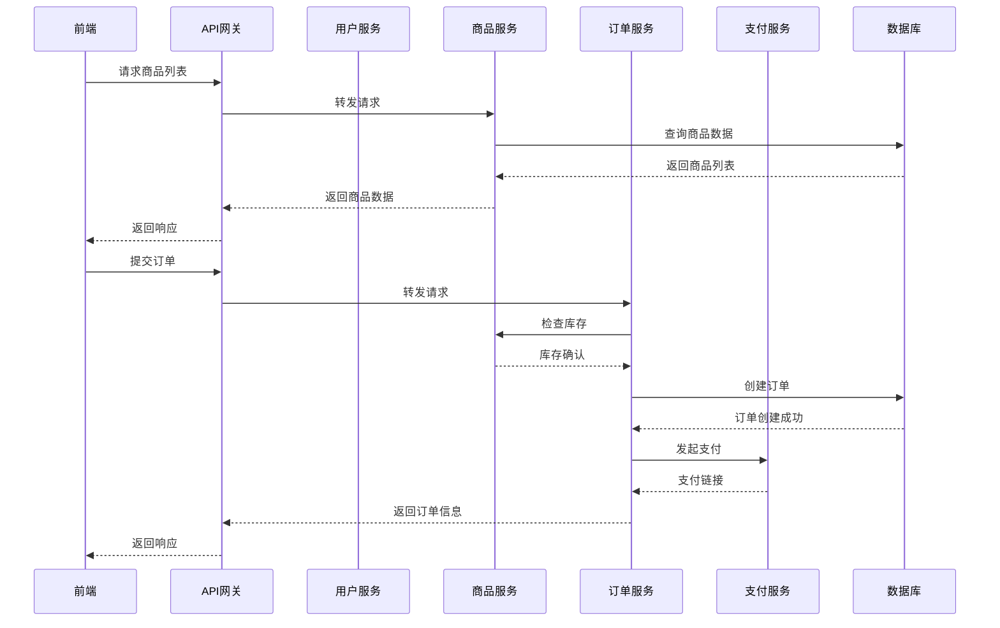
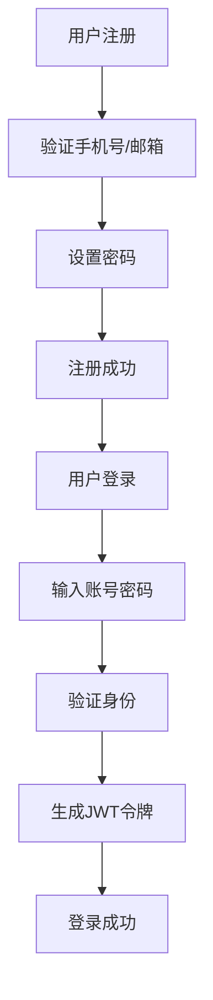
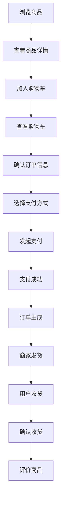
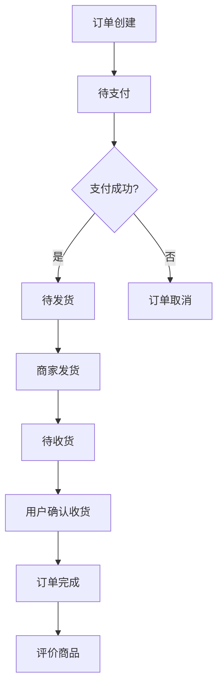

# 电商平台方案设计

## 1. 方案概述

基于当前项目技术栈（Spring Boot 4.0.5 + Java 17 + WebFlux），设计一个现代化、高性能的电商平台。该平台将支持用户管理、商品管理、购物车、订单管理、支付、评价和推荐系统等核心功能，并集成Spring AI能力提供智能推荐和客服支持。

## 2. 技术架构

### 2.1 技术栈选择

| 分类 | 技术 | 版本 | 说明 |
|------|------|------|------|
| 后端框架 | Spring Boot | 4.0.5 | 基础框架，提供自动配置和依赖管理 |
| 响应式编程 | Spring WebFlux | 4.0.5 | 非阻塞异步编程，提升系统性能 |
| 数据库 | MySQL | 8.0+ | 关系型数据库，存储核心业务数据 |
| 缓存 | Redis | 7.0+ | 缓存热点数据，提升响应速度 |
| 搜索引擎 | Elasticsearch | 8.0+ | 商品搜索和推荐 |
| 消息队列 | RabbitMQ | 3.10+ | 异步处理订单和库存 |
| 认证授权 | Spring Security | 6.0+ | JWT认证和权限管理 |
| AI集成 | Spring AI | 2.0.0-M4 | 智能推荐和客服支持 |
| 容器化 | Docker | 20.10+ | 应用容器化部署 |
| 编排 | Kubernetes | 1.24+ | 容器编排和服务发现 |

### 2.2 架构设计

- **微服务架构**：将系统拆分为多个独立的微服务
- **响应式设计**：使用WebFlux实现非阻塞异步处理
- **分层架构**：
  - 表现层（Controller）：处理HTTP请求和响应
  - 业务层（Service）：实现核心业务逻辑
  - 数据访问层（Repository）：与数据库交互
  - 基础设施层：提供通用功能和工具

### 2.3 核心流程图

## 3. 核心功能模块

### 3.1 用户管理模块

- **用户注册**：支持手机号、邮箱注册，包含验证码验证
- **用户登录**：支持账号密码登录、短信验证码登录、第三方登录
- **个人信息管理**：修改头像、昵称、密码、收货地址等
- **权限管理**：基于角色的权限控制，支持管理员、普通用户等角色

### 3.2 商品管理模块

- **商品分类**：支持多级分类，树形结构展示
- **商品列表**：支持分页、排序、筛选
- **商品详情**：展示商品图片、价格、描述、库存等信息
- **商品搜索**：支持关键词搜索、模糊搜索
- **商品推荐**：基于用户行为和偏好的智能推荐

### 3.3 购物车模块

- **添加商品**：将商品加入购物车，支持选择规格和数量
- **修改数量**：调整购物车中商品数量
- **删除商品**：从购物车中移除商品
- **清空购物车**：一键清空购物车
- **购物车结算**：将购物车商品生成订单

### 3.4 订单管理模块

- **创建订单**：从购物车生成订单，支持选择收货地址和支付方式
- **订单列表**：查看用户所有订单，支持按状态筛选
- **订单详情**：查看订单详细信息，包括商品列表、物流信息等
- **订单状态管理**：支持待支付、待发货、待收货、已完成、已取消等状态
- **订单退款**：支持申请退款和退款处理

### 3.5 支付模块

- **支付方式**：支持微信支付、支付宝、银行卡支付等
- **支付流程**：生成支付链接，跳转第三方支付平台
- **支付回调**：处理支付结果通知
- **支付记录**：查看历史支付记录

### 3.6 评价模块

- **商品评价**：购买后对商品进行评价，支持文字、图片、视频
- **评价管理**：商家回复评价，管理员审核评价
- **评价统计**：商品评分统计和展示

### 3.7 推荐系统模块

- **个性化推荐**：基于用户浏览和购买历史推荐商品
- **热门商品推荐**：展示销量高、评分高的商品
- **相关商品推荐**：基于当前商品推荐相似商品
- **AI智能推荐**：使用Spring AI提供更精准的推荐

### 3.8 后台管理模块

- **商品管理**：添加、编辑、删除商品，管理商品库存
- **订单管理**：处理订单，更新订单状态，安排发货
- **用户管理**：管理用户账号，处理用户反馈
- **数据统计**：销售数据、用户数据、商品数据统计
- **系统设置**：配置系统参数，管理系统权限

## 4. 数据库设计

### 4.1 核心表结构

| 表名 | 说明 | 核心字段 |
|------|------|---------|
| `user` | 用户表 | `id`, `username`, `password`, `email`, `phone`, `avatar`, `created_at` |
| `address` | 收货地址表 | `id`, `user_id`, `name`, `phone`, `province`, `city`, `district`, `detail_address`, `is_default` |
| `category` | 商品分类表 | `id`, `name`, `parent_id`, `level`, `sort` |
| `product` | 商品表 | `id`, `name`, `description`, `price`, `stock`, `category_id`, `main_image`, `created_at` |
| `product_sku` | 商品SKU表 | `id`, `product_id`, `specs`, `price`, `stock`, `sku_image` |
| `cart` | 购物车表 | `id`, `user_id`, `product_id`, `sku_id`, `quantity`, `created_at` |
| `order` | 订单表 | `id`, `order_no`, `user_id`, `address_id`, `total_amount`, `status`, `payment_method`, `created_at` |
| `order_item` | 订单商品表 | `id`, `order_id`, `product_id`, `sku_id`, `quantity`, `price` |
| `payment` | 支付记录表 | `id`, `order_id`, `payment_method`, `transaction_id`, `amount`, `status`, `created_at` |
| `review` | 评价表 | `id`, `user_id`, `product_id`, `order_id`, `rating`, `content`, `images`, `created_at` |
| `logistics` | 物流表 | `id`, `order_id`, `logistics_company`, `tracking_number`, `status`, `created_at` |
| `recommendation` | 推荐表 | `id`, `user_id`, `product_id`, `score`, `created_at` |

### 4.2 索引设计

- **用户表**：`username`、`email`、`phone`建立唯一索引
- **商品表**：`category_id`、`price`、`stock`建立索引
- **订单表**：`order_no`、`user_id`、`status`建立索引
- **购物车表**：`user_id`、`product_id`建立联合索引
- **评价表**：`product_id`、`user_id`建立索引

## 5. API接口规范

### 5.1 用户模块API

| API路径 | 方法 | 功能 | 权限 |
|---------|------|------|------|
| `/api/users/register` | POST | 用户注册 | 无 |
| `/api/users/login` | POST | 用户登录 | 无 |
| `/api/users/profile` | GET | 获取用户信息 | 登录用户 |
| `/api/users/profile` | PUT | 更新用户信息 | 登录用户 |
| `/api/users/addresses` | GET | 获取地址列表 | 登录用户 |
| `/api/users/addresses` | POST | 添加地址 | 登录用户 |
| `/api/users/addresses/{id}` | PUT | 更新地址 | 登录用户 |
| `/api/users/addresses/{id}` | DELETE | 删除地址 | 登录用户 |

### 5.2 商品模块API

| API路径 | 方法 | 功能 | 权限 |
|---------|------|------|------|
| `/api/products` | GET | 获取商品列表 | 无 |
| `/api/products/{id}` | GET | 获取商品详情 | 无 |
| `/api/products/search` | GET | 搜索商品 | 无 |
| `/api/categories` | GET | 获取分类列表 | 无 |
| `/api/products/recommend` | GET | 获取推荐商品 | 无 |

### 5.3 购物车模块API

| API路径 | 方法 | 功能 | 权限 |
|---------|------|------|------|
| `/api/cart` | GET | 获取购物车列表 | 登录用户 |
| `/api/cart` | POST | 添加商品到购物车 | 登录用户 |
| `/api/cart/{id}` | PUT | 更新购物车商品数量 | 登录用户 |
| `/api/cart/{id}` | DELETE | 删除购物车商品 | 登录用户 |
| `/api/cart/clear` | POST | 清空购物车 | 登录用户 |

### 5.4 订单模块API

| API路径 | 方法 | 功能 | 权限 |
|---------|------|------|------|
| `/api/orders` | POST | 创建订单 | 登录用户 |
| `/api/orders` | GET | 获取订单列表 | 登录用户 |
| `/api/orders/{id}` | GET | 获取订单详情 | 登录用户 |
| `/api/orders/{id}/cancel` | POST | 取消订单 | 登录用户 |
| `/api/orders/{id}/pay` | POST | 支付订单 | 登录用户 |
| `/api/orders/{id}/confirm` | POST | 确认收货 | 登录用户 |

### 5.5 支付模块API

| API路径 | 方法 | 功能 | 权限 |
|---------|------|------|------|
| `/api/payments/{orderId}` | POST | 发起支付 | 登录用户 |
| `/api/payments/callback` | POST | 支付回调 | 无 |
| `/api/payments/history` | GET | 获取支付历史 | 登录用户 |

### 5.6 评价模块API

| API路径 | 方法 | 功能 | 权限 |
|---------|------|------|------|
| `/api/reviews` | POST | 提交评价 | 登录用户 |
| `/api/reviews/product/{productId}` | GET | 获取商品评价 | 无 |
| `/api/reviews/order/{orderId}` | GET | 获取订单评价 | 登录用户 |

### 5.7 推荐模块API

| API路径 | 方法 | 功能 | 权限 |
|---------|------|------|------|
| `/api/recommendations/personalized` | GET | 获取个性化推荐 | 登录用户 |
| `/api/recommendations/hot` | GET | 获取热门商品 | 无 |
| `/api/recommendations/related/{productId}` | GET | 获取相关商品 | 无 |

### 5.8 后台管理API

| API路径 | 方法 | 功能 | 权限 |
|---------|------|------|------|
| `/api/admin/products` | GET | 获取商品列表 | 管理员 |
| `/api/admin/products` | POST | 添加商品 | 管理员 |
| `/api/admin/products/{id}` | PUT | 更新商品 | 管理员 |
| `/api/admin/products/{id}` | DELETE | 删除商品 | 管理员 |
| `/api/admin/orders` | GET | 获取订单列表 | 管理员 |
| `/api/admin/orders/{id}` | PUT | 更新订单状态 | 管理员 |
| `/api/admin/users` | GET | 获取用户列表 | 管理员 |
| `/api/admin/stats` | GET | 获取统计数据 | 管理员 |

## 6. 业务流程

### 6.1 用户注册登录流程

### 6.2 商品购买流程

### 6.3 订单处理流程

## 7. 用户体验设计

### 7.1 响应式设计

- **PC端**：完整功能，多列布局
- **移动端**：适配手机屏幕，简化操作流程
- **平板端**：介于PC和移动端之间的布局

### 7.2 性能优化

- **页面加载速度**：优化图片资源，使用CDN加速
- **响应时间**：使用缓存，减少数据库查询
- **用户交互**：添加加载动画，提升用户体验

### 7.3 个性化体验

- **智能推荐**：基于用户行为推荐商品
- **个性化首页**：根据用户偏好展示内容
- **定制化购物车**：记住用户的购物车状态

### 7.4 安全性

- **数据加密**：敏感数据加密存储
- **HTTPS**：全站使用HTTPS协议
- **防SQL注入**：使用参数化查询
- **防XSS攻击**：过滤用户输入

## 8. 部署和运维方案

### 8.1 部署架构

- **开发环境**：本地开发，使用Docker容器
- **测试环境**：独立的测试服务器，模拟生产环境
- **生产环境**：Kubernetes集群，多节点部署

### 8.2 环境配置

- **数据库**：主从复制，读写分离
- **缓存**：Redis集群，高可用
- **消息队列**：RabbitMQ集群，保证消息可靠性
- **搜索引擎**：Elasticsearch集群，分片存储

### 8.3 监控和日志

- **系统监控**：使用Prometheus和Grafana监控系统指标
- **应用监控**：使用Spring Boot Actuator监控应用状态
- **日志管理**：使用ELK Stack收集和分析日志
- **告警系统**：设置阈值告警，及时发现问题

### 8.4 安全策略

- **防火墙**：配置防火墙规则，限制访问
- **入侵检测**：部署入侵检测系统
- **定期安全扫描**：使用安全工具定期扫描漏洞
- **安全更新**：及时更新依赖和系统补丁

### 8.5 备份和恢复

- **数据库备份**：定期全量备份和增量备份
- **文件备份**：静态资源和配置文件备份
- **灾难恢复**：制定灾难恢复计划，定期演练

### 8.6 性能优化

- **数据库优化**：索引优化，SQL语句优化
- **缓存优化**：合理设置缓存策略
- **代码优化**：减少不必要的计算和IO操作
- **服务器优化**：调整服务器参数，提升性能

### 8.7 故障处理

- **故障检测**：自动检测系统故障
- **故障隔离**：限制故障影响范围
- **故障恢复**：自动或手动恢复系统
- **故障分析**：分析故障原因，防止再次发生

### 8.8 扩展性考虑

- **水平扩展**：支持通过增加节点扩展系统容量
- **垂直扩展**：支持通过升级硬件提升系统性能
- **服务拆分**：根据业务需求拆分服务
- **API网关**：统一管理API，支持流量控制和负载均衡

## 9. 实施计划

### 9.1 项目阶段

1. **需求分析和设计**：2周
2. **基础架构搭建**：2周
3. **核心功能开发**：8周
   - 用户管理模块：1周
   - 商品管理模块：2周
   - 购物车模块：1周
   - 订单管理模块：2周
   - 支付模块：1周
   - 评价模块：1周
4. **测试和优化**：4周
5. **部署和上线**：2周

### 9.2 团队配置

- **后端开发**：3人
- **前端开发**：2人
- **测试**：1人
- **DevOps**：1人
- **产品经理**：1人

## 10. 总结

本电商平台方案基于Spring Boot 4.0.5和WebFlux技术栈，采用微服务架构和响应式设计，提供了完整的电商功能。方案涵盖了技术架构、核心功能、数据库设计、API接口、业务流程、用户体验和部署运维等各个方面，为电商平台的开发和运营提供了全面的指导。

该方案具有以下特点：
- **现代化技术栈**：使用最新的Spring Boot和WebFlux技术，支持响应式编程
- **完整的功能模块**：涵盖了电商平台的核心功能，满足用户和商家的需求
- **高性能设计**：采用微服务架构和缓存策略，提升系统性能
- **良好的用户体验**：响应式设计和个性化推荐，提升用户满意度
- **可靠的部署方案**：完善的监控、安全和备份策略，保证系统稳定运行

通过本方案的实施，可以构建一个高性能、可扩展、用户友好的电商平台，为用户提供优质的购物体验，为商家提供高效的管理工具。